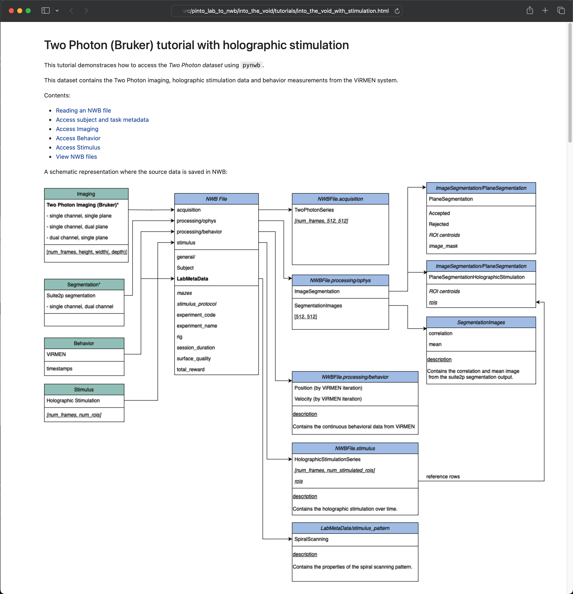

# pinto-lab-to-nwb
NWB conversion scripts for Pinto lab data to the [Neurodata Without Borders](https://nwb-overview.readthedocs.io/) data format.

## Installation

The package can be installed directly from GitHub, which has the advantage that the source code can be modified if you need to amend some of the code we originally provided to adapt to future experimental differences.
To install the conversion from GitHub you will need to use `git` ([installation instructions](https://github.com/git-guides/install-git)). We also recommend the installation of `conda` ([installation instructions](https://docs.conda.io/en/latest/miniconda.html)) as it contains
all the required machinery in a single and simple install.

From a terminal (note that conda should install one in your system) you can do the following:

```
git clone https://github.com/catalystneuro/pinto-lab-to-nwb
cd pinto-lab-to-nwb
conda env create --file make_env.yml
conda activate pinto-lab-to-nwb-env
```

This creates a [conda environment](https://docs.conda.io/projects/conda/en/latest/user-guide/concepts/environments.html) which isolates the conversion code from your system libraries.
We recommend that you run all your conversion related tasks and analysis from the created environment in order to minimize issues related to package dependencies.

Alternatively, if you want to avoid conda altogether (for example if you use another virtual environment tool)
you can install the repository with the following commands using only pip:

```
git clone https://github.com/catalystneuro/pinto-lab-to-nwb
cd pinto-lab-to-nwb
pip install -e .
```

Note: both of the methods above install the repository in [editable mode](https://pip.pypa.io/en/stable/cli/pip_install/#editable-installs).

## Repository structure
Each conversion is organized in a directory of its own in the `src` directory:

    pinto-lab-to-nwb/
    ├── LICENSE
    ├── make_env.yml
    ├── pyproject.toml
    ├── README.md
    ├── requirements.txt
    ├── setup.py
    └── src
        ├── pinto_lab_to_nwb
        │   └── into_the_void
        │       ├── tutorials
        │       │   ├── into_the_void_with_stimulation.ipynb
        │       ├── general_metadata.yaml
        │       ├── into_the_void_convert_session.py
        │       ├── into_the_voidnwbconverter.py
        │       ├── into_the_void_requirements.txt
        │       ├── into_the_void_notes.md

        │       └── __init__.py

        └── __init__.py

 For example, for the conversion `into_the_void` you can find a directory located in `src/pinto-lab-to-nwb/into_the_void`. Inside each conversion directory you can find the following files:

* `into_the_void_convert_sesion.py`: this script defines the function to convert one full session of the conversion.
* `into_the_void_requirements.txt`: dependencies specific to this conversion.
* `general_metadata.yml`: general metadata in yaml format (e.g. session description, experimenter, subject metadata).
* `into_the_voidnwbconverter.py`: the place where the `NWBConverter` class is defined.
* `into_the_void_notes.md`: notes and comments concerning this specific conversion.
* `tutorials`: a directory containing tutorials and examples for this specific conversion.

The directory might contain other files that are necessary for the conversion but those are the central ones.

## Running a specific conversion

To run a specific conversion, you might need to install first some conversion specific dependencies that are located in each conversion directory:
```
pip install -r src/pinto_lab_to_nwb/into_the_void/into_the_void_requirements.txt
```

You can then edit the experiment metadata as desired in the file `src/pinto_lab_to_nwb/into_the_void/general_metadata.yaml`.
Here is an example of the content of this file:
```yaml
NWBFile:
  session_description:
    A rich text description of the experiment. Can also just be the abstract of the publication.
  institution: Northwestern University
  lab: Pinto
  experimenter:
    - Canton, Neto
Subject:
  species: Mus musculus
  sex: U
```

Finally, you can run the conversion with the following command:

```
python src/pinto_lab_to_nwb/into_the_void/into_the_void_convert_session.py
```

### into_the_void conversion

The `into_the_void` conversion is a conversion of a two-photon imaging dataset acquired with a Bruker Ultima microscope.
The conversion function can be found in `src/pinto_lab_to_nwb/into_the_void/into_the_void_convert_session.py`.
The `session_to_nwb` function can be run by running the file directly, as shown in the previous section, or
by importing the function elsewhere and running it in an alternate script or Jupyter notebook.

The function takes in a number of arguments:
* `nwbfile_path`: The path to the NWB file to be created.
* `imaging_folder_path`: The folder path that contains the Bruker TIF imaging output (.ome.tif files).
* `segmentation_folder_path`: The folder that contains the Suite2P segmentation output.
* `subject_metadata_file_path`: The path to the subject metadata file. (e.g. `subject_metadata.mat`, optional)
* `stub_test`: Whether convert and save only a portion of the imaging and segmentation dara, used only for testing purposes (default: `False`).

The conversion can be configured by editing YAML files, the `general_metadata.yaml` file contains experimental metadata,
like the session description, the name of the experimenter(s), the subject metadata, etc.

For those sessions where holographic stimulation was performed, the conversion will also include the holographic stimulation data.
You can then edit the holographic stimulation metadata as desired in the file `src/pinto_lab_to_nwb/into_the_void/holographic_stimulation_metadata.yaml`.
Here is an example of the content of this file:
```yaml
Ophys:
  OptogeneticDevice:
    SpatialLightModulator:
      name: spatial_light_modulator
      description: |
        NeuraLight 3D SLM Module for Photoactivation Pathway, multi-region, holographic stimulation
        and activation module using 512 x 512 spatial light modulator with Overdrive technology.
      manufacturer: NeuraLight
    LightSource:
      name: light_source
      description: |
        The Coherent Monaco laser used for holographic stimulation with 251 fs pulse width and 2 MHz pulse rate.
      stimulation_wavelength: 1035.0 # nm
      power: 700.0 # the peak power of stimulation in Watts
      filter_description: short pass 1040 nm filter
      intensity: 0.005 # the intensity of excitation in Watts
      exposure_time: 0.000000000000251 # the exposure time of the sample in seconds
      pulse_rate: 2000000.0 # the pulse rate of the laser is in Hz
  OptogeneticStimulusSite:
    - name: site
      description: |
        The targeted location of the holographic stimulation.
      excitation_lambda: 1050.0 # nm
      effector: ChRmine # the peak power of stimulation in Watts
      location: VISp # the targeted brain region (e.g. VISp)
```
See the [conserion notes](src/pinto_lab_to_nwb/into_the_void/into_the_void_notes.md) for more details on the expected data format.

## Interacting with the NWB files

We created tutorials for each conversion that demonstrate how to interact with the NWB files created by the conversion scripts.

### NWB tutorials

The `tutorials` directory contains Jupyter notebooks that demonstrate how to use the NWB files created by the conversion scripts.

You might need to install `jupyter` before running the notebooks:

```
pip install jupyter
cd src/pinto_lab_to_nwb/into_the_void/tutorials
jupyter lab
```


We recommend installing NWB GUIDE ([installation instructions](https://nwb-guide.readthedocs.io/en/latest/installation.html)) to visualize the NWB files.
